# Figma For Beginners

## Four main areas
### Toolbar
在工具栏中找到创建工具（矩形、圆形等）和导航工具（移动工具等）。

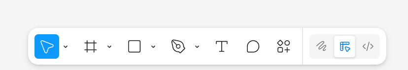

### Left sidebar
在左侧边栏访问页面、图层和组件。

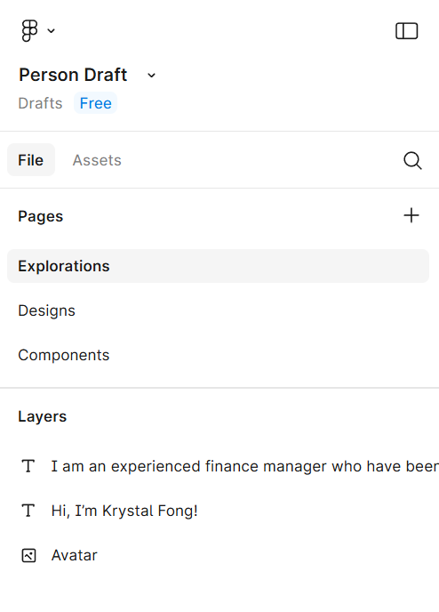

### Right sidebar

右侧边栏调整对象的属性、导出内容、添加原型连线。

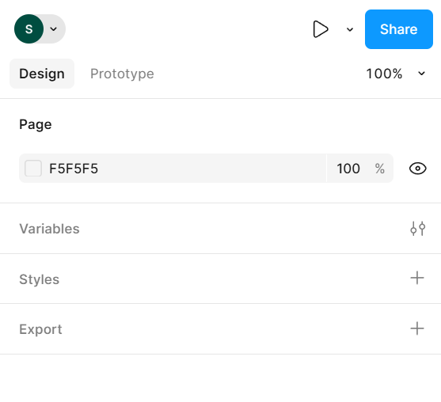

### Canvas

画布完善和构建我们的设计。

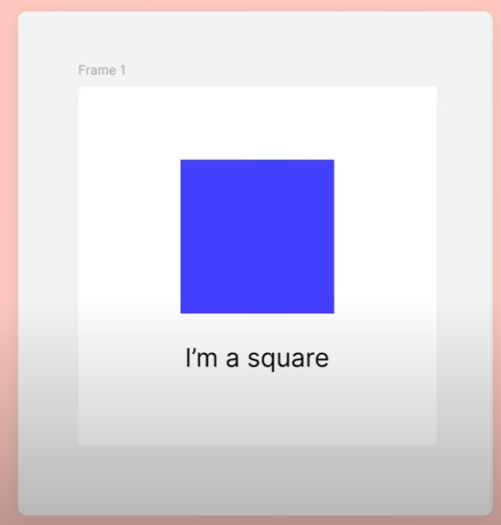

## Set file preferences

说明：设置任何的首选项都会应用于 `Figma` 上的所有文件（全局配置）。

### Property lables

默认设置，`Figma` 右侧边栏没有添加属性标签，手动设置添加属性标签。

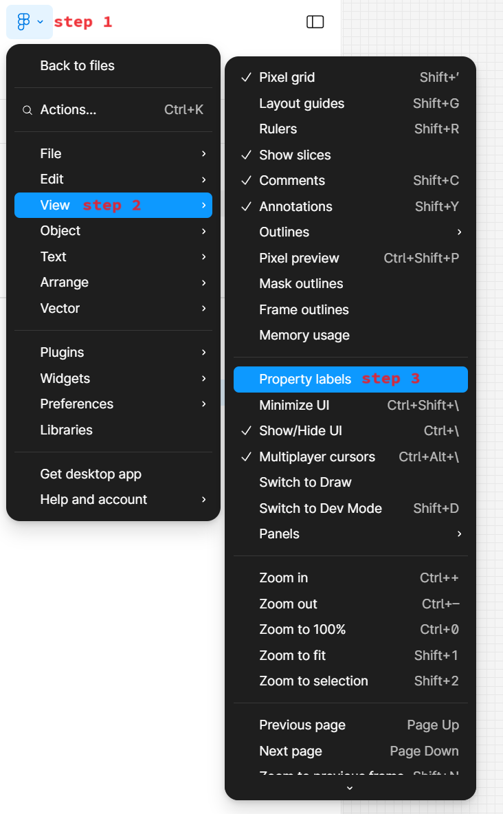

## Create the landing page hero

`Hero` 是网页顶部的一大块区域，通常用户吸引用户的注意力、传达信息或者促使采取行动。

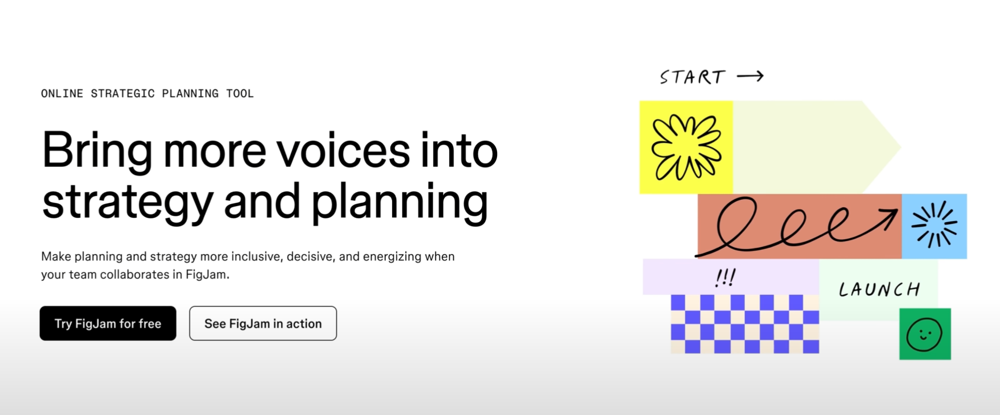

我们首先使用带有图像填充的形状来构建头像；然后，使用文本添加姓名和描述信息。

### Layers

在 `Figma Design` 中，图层是用来创建设计所使用的构建模块。

我们会用到几个基础图层：文本、形状和框架。

1. 文本：`text`。
2. 形状：`shapes`。
3. 框架：`frames`。

每一层都代表设计的一部分，能够分离背景，对象，以及各个细节。这能帮助控制每一层的外观，它们出现的顺序，以及如何相互交互。

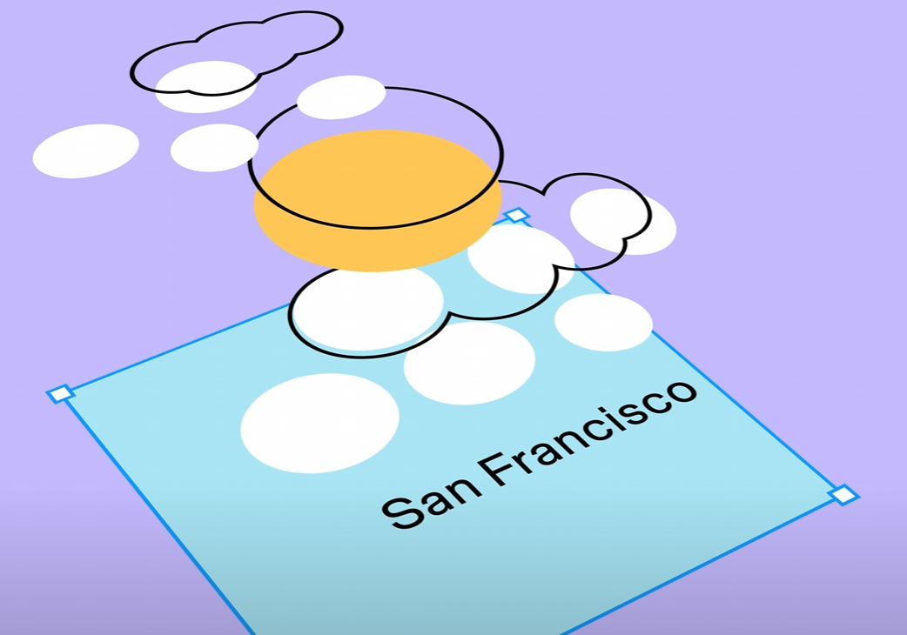

每种图层类型都带有各种属性，用于控制外观和行为。例如：

1. 画布上的位置。
2. 形状的宽度和高度。
3. 填充的颜色。
4. 描边、模糊或阴影。
5. 设置字体。

这些图层汇集在一起，创建了一个灵活的设计，可以很方便地控制每个细节。

### Images and fills

当我们在画布中添加形状时， 我们实际上是在创建形状的轮廓，也成为矢量路径 `vector path`。

默认情况下，`Figma` 会使用纯灰色填充路径内部的空间，如果我们想在路径里面放入填充物，使用右侧边栏的填充 `fill` 选项。

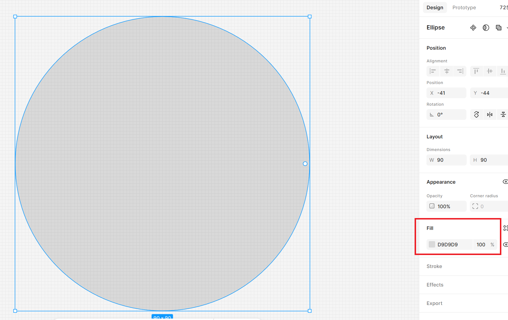

 当点击填充选项后，`Figma` 提供了四种填充类型。

1. 纯色。
2. 渐变。
3. 图片。
4. 视频。

一个图层可以有多个填充，上下拖动这些填充重新排序或从混合中删除。

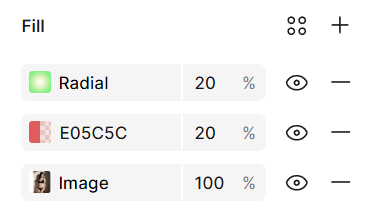

> 填充不仅限于形状，它们也可以应用于其他图层类型，如文本、框架和区域。

### Crop images

如果图片在形状中的位置不理想，选中图层后点击右侧边栏的裁剪图片按钮。

点击并拖动图像重新定位。

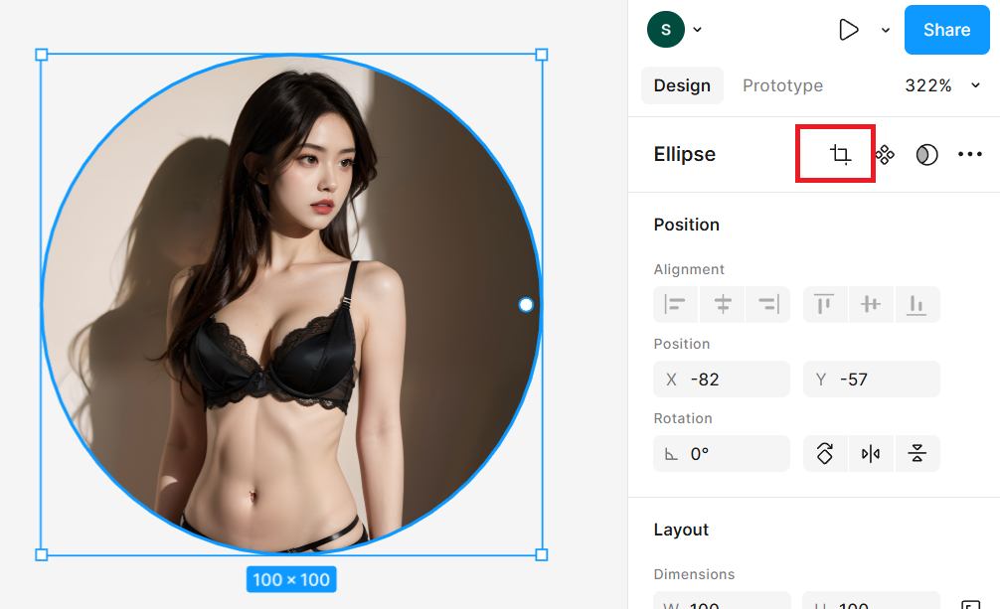

### Text

右侧边栏排版(typography)部分可以找到字体相关的设置。

支持选择在线的免费字体，同时也支持使用计算上安装的字体(需要安装desktop Figma)。

鼠标悬停在字体名称上预览当前的字体。

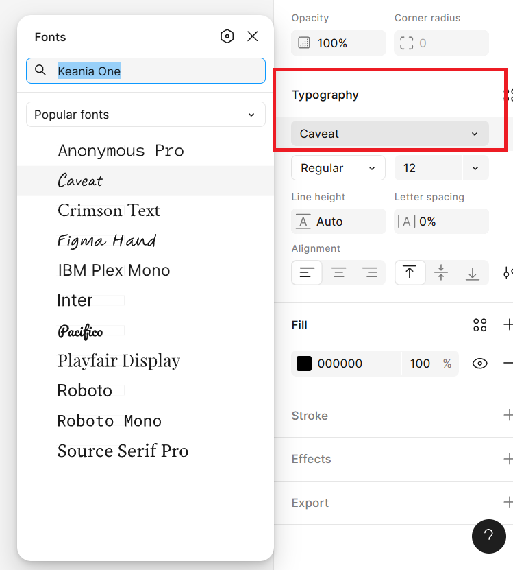

打开字体类型设置(Type Settings)，支持更多的属性配置。

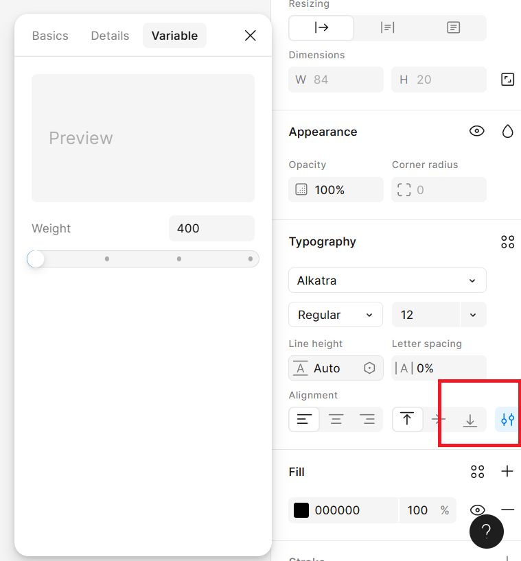

### Text resizing properties

文本图层具有调整大小的属性(Text Resizing)，该属性决定了当我们更改其内容时图层尺寸将如何变化。

1. Fixed size：固定大小。字体图层具有精确的尺寸，并调整大小设置为固定大小。这意味着无论有多少文本内容，文本层的宽度和高度都将保持不变。
2. Auto width：自动宽度。文本层水平增长来容纳新的文本。
3. Auto height：自动高度。文本层的高度自适应，添加新的文本将自动换行，从而增加文本层的高度；如果我们删除文本，高度就会自动减少。

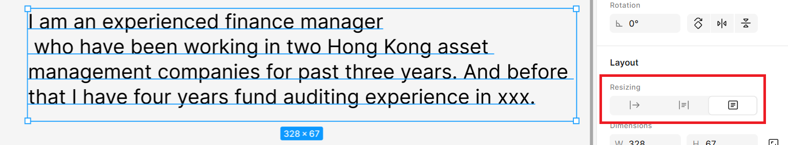

- 当我们拖动文本框的角锚点时，Text Resizing 会自动切换为 Fixed Size。
- 当前是 Auto width 时，拖动文本框的边时，Text Resizing 会自动切换为 Auto height。

### Update title text styling

点击画布(Canvas)的空白区域可以取消选中状态，鼠标单击并拖动光标到图层上可以批量选中它们。在右侧边栏中，单击“左对齐”(Align left) 可以使得选中的图层对齐最左侧的边缘。

同理，“居中”(Align horizontal centers) 会使得选中的图层全部居中，“右对齐”(Align right)会使得选中的图层对齐最右侧的边缘。

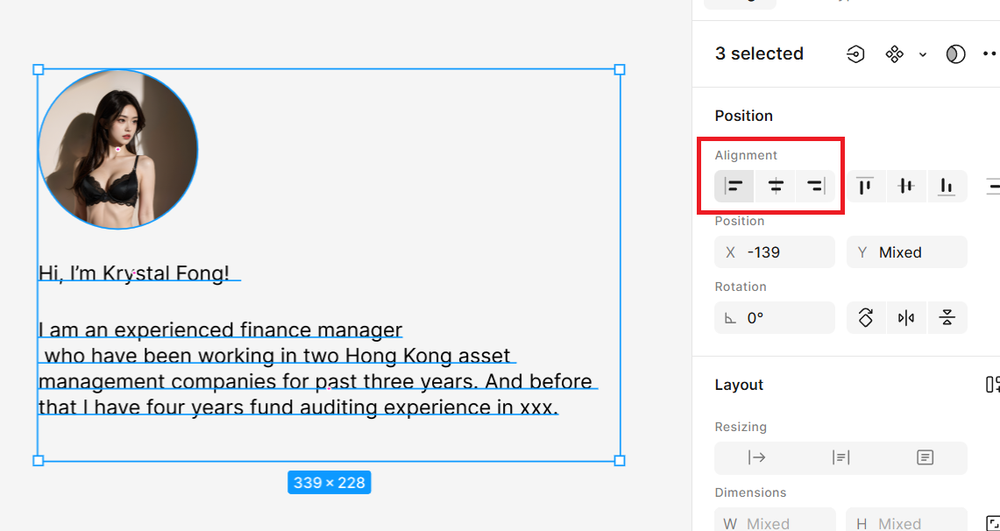

### Nudge settings

可以使用键盘上的方向键移动图层来重新定位图层。

Figma 中有两种推动类型(Nudge)

1. 微调(Small Nudge)：使用键盘的方向键进行小幅度移动重新定位图层，默认以 1 为增量移动图层。
2. 大幅度调整(Big Nudge)：`SHIFT + ARROW KEYS` 默认以 10 为增量移动图层。

**如何设置特定的微调增量？**

当使用特定的网格系统(例如8像素网格系统)，以8为增量进行微调会更有用。

下面是自定义微调的增量 Nudge Settings。

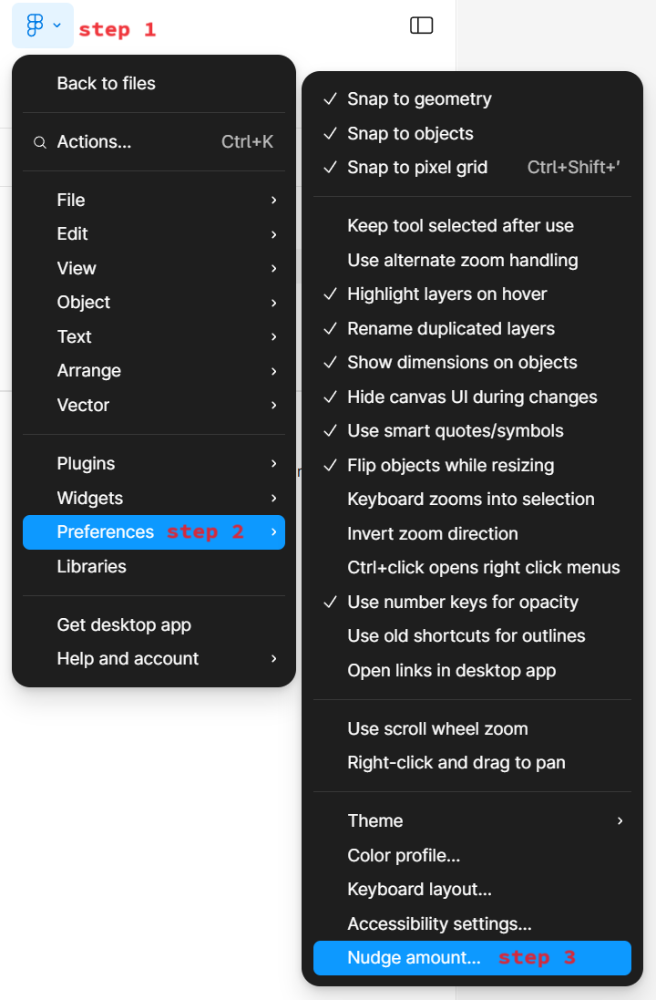

### Frames

Frame 是 Figma 中的核心构建块。它充当其他层(Layer)的容器，将这些层组织到一起。

1. 可以使用 Frame 创建单独的资产(Assets/Component)，例如：图标、按钮、设计图的各个部分或整个屏幕布局。
2. 甚至可以在 Frame 中放置或嵌套其他 Frame。

我们将充当容器的任何层(Layer)称为父层，将其内部的任何 Frame 或 Layer 称为子层。

直接放置在画布(Canvas)上的 Frame 称为顶层框架(Top Frame)。

Frames 支持一些基础的属性：宽高(Dimensions)、填充(Fill)、特效(Effects)等。

同时，Frames还支持一些高级特性，例如裁剪，它允许隐藏超出 Frame 边界的任何子内容。并且允许将静态设计变成交互式原型。

创建 Frame，使用底部工具栏(Toolbar)中的 Frame 工具或者按键盘 `F` 键。单击画布(Canvas)上的任意位置放置 Frame，或单击并拖动创建具有高度宽度的 Frame。

### Add layers to a frame

左侧边栏中 Frame 包含子层的目录形式，证明我们 Frame 创建成功。

单击拖动 Layer 可以从 Frame 中添加或移出。

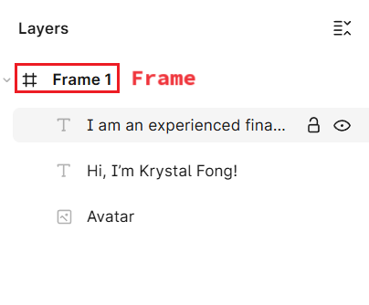

Landing Page Hero 展示效果如下：

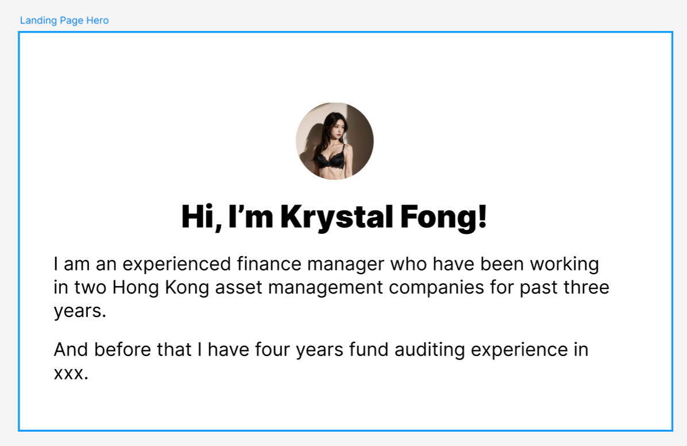

## Create the case study page

### Frame presets

框架预设(Frame presets)是现成的框架尺寸的集合。

它们允许快速创建流行尺寸的框架(Frame)，这样就不用记住或猜测 Frame 需要什么尺寸。

当在底部工具栏中选择 Frame 工具时，右侧边栏中会出现各种设备的尺寸预设。

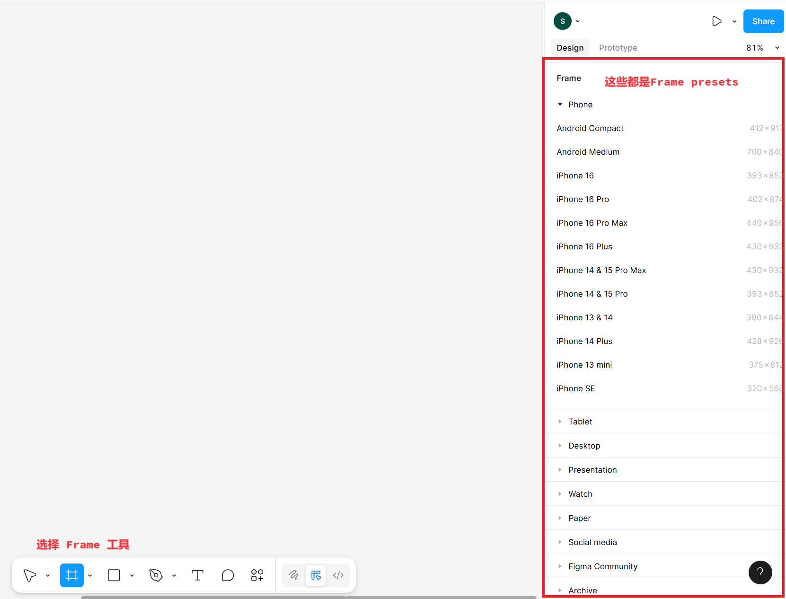

### Create a frame using frame presets

在底部工具栏中选择 Frame 工具，右侧边栏中选择 Desktop 1440 × 1024 尺寸的预设，在画布(Canvas)空白处单击创建 Frame。

### Create the section heading

在底部工具栏中选择文本工具，在 Frame 中单击。文本图层会自动变为 Frame 的子图层。

左侧边栏，Layers 会显示这一特性。

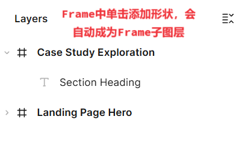

设置 Heading 文本样式：

- 字体大小：28。
- 字体粗细：粗体(Bold)。
- 行高：38。

### Create the paragraph text

在底部工具栏中选择文本工具，在 Frame 中单击并拖动创建一个文本框，同理，这个文本图层会自动变为 Frame 的子图层。

然后，在文本图层中添加几段文本。

设置 Paragraph 文本样式：

- 字体大小：20 。
- 字体粗细：中等(medium)。
- Text Resizing：Auto height。
- 行高：38 。
- 段落间距：24 。
- 文本框宽度：1000 。

**如何设置段落间距？**

1. 选中文本图层。
2. 在右侧边栏中单击`Type Settings` 按钮。
3. 提示框选择 `Basic`，设置 `Paragraph spacing` 。

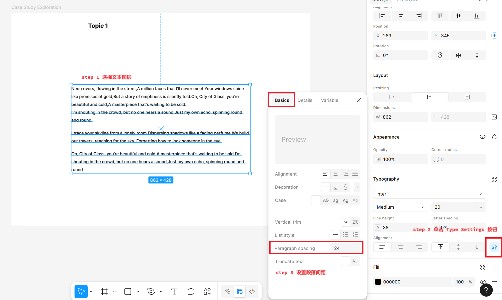

### Create the quote block

在底部工具栏中选择文本工具，在 Frame 中单击并拖动创建一个文本框，我们使它宽度和上面的段落文本(Paragraph Text)宽度大致相同。

为引用框(Quoute Block)输入一些文本作为占位符。

设置 Quoute 文本样式：

- 字体大小：24 。
- 字体粗细：Medium italic。
- Text Resizing：Auto height。
- 行高：38 。
- 段落间距：24 。
- 文本框宽度：570。
- 文本居中对齐。

### Text alignment

文本对齐(Text Alignment)决定了文本内容在其边界框内的分布方式。

在右侧边栏的排版(Typography)设置中可以选择水平文本对齐和垂直文本对齐。

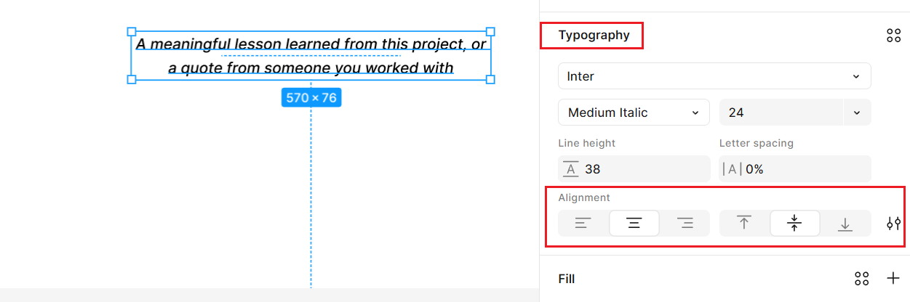

### Create the image layer

在底部工具栏中选择矩形工具，在 Frame 中单击并拖动创建一个任意大小的矩形。

为了使图像内容与段落(paragraph)文本框的大小保持一致，设置宽度为 1000，高度设置为 562，接近 16:9 的宽高比。

选中创建的图层，右侧边栏填充(Fill)选项，打开颜色选择器并选择顶部的图像(Image)选项，图层填充会变为灰色和白色的棋盘格图案，这表示图片占位符。

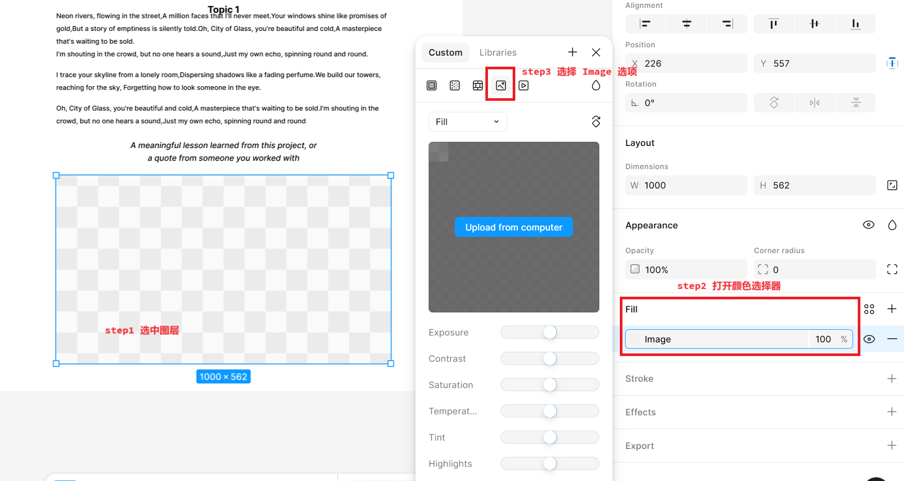

### Create the hero

在底部工具栏中选择文本工具，在 Frame 中单击创建一个文本框。

设置标题字体样式：

- 字体大小：76。
- 字体粗细：Bold。
- Text Resizing：Auto height。
- 行高：Auto。
- 文本居中对齐。
- 文本图层(Layer)置于框架(Frame)中心。

选中标题文本框，右键单击并选择 `Frame selection` 选项，文本层会放置在一个新的 Frame 中。

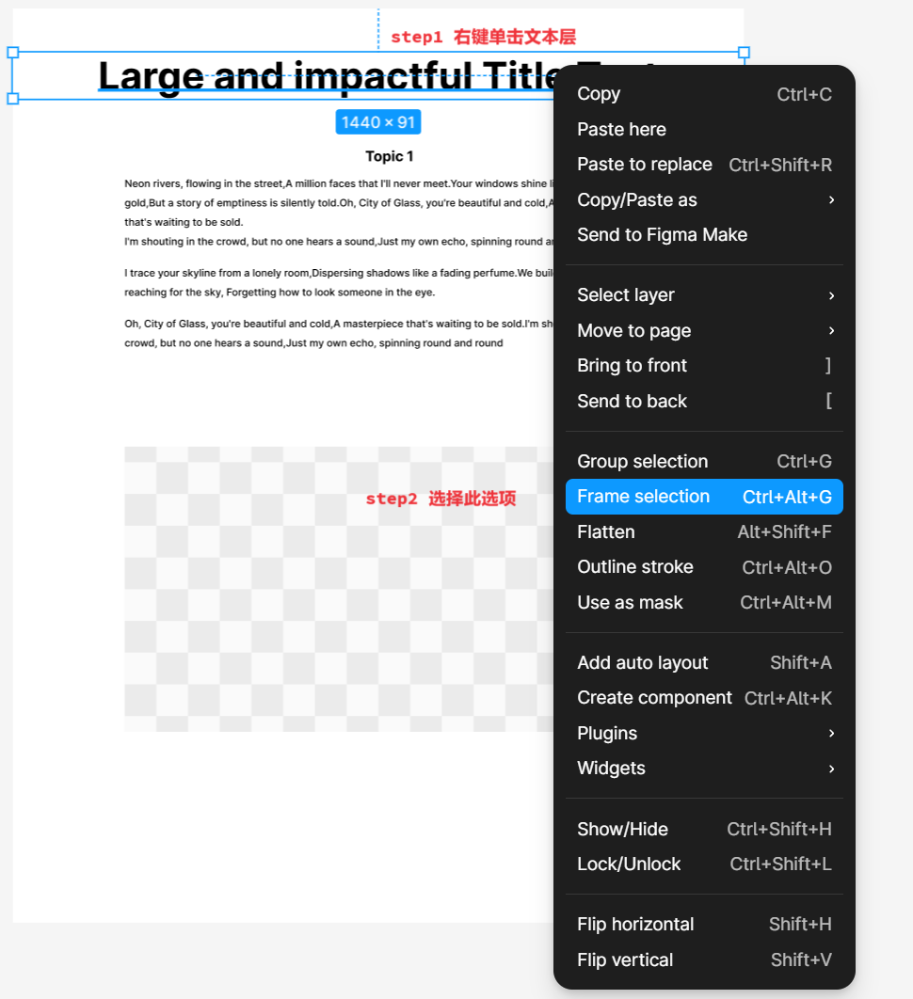

然后，使用 [Create the image layer](#Create the image layer) 中的方法向框架(Frame)中添加图像填充。

为文本添加 Frame 后，调整 Frame 的宽度和高度，直到宽度与父 Frame 对齐。当对齐时，会有红色的叉号显示。

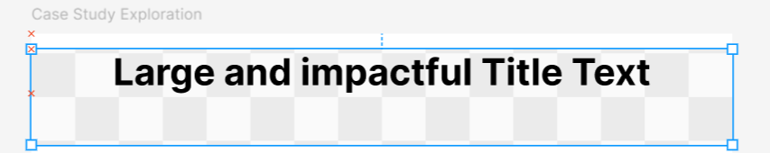

如果没有出现这个红色的叉号，需要修改配置。

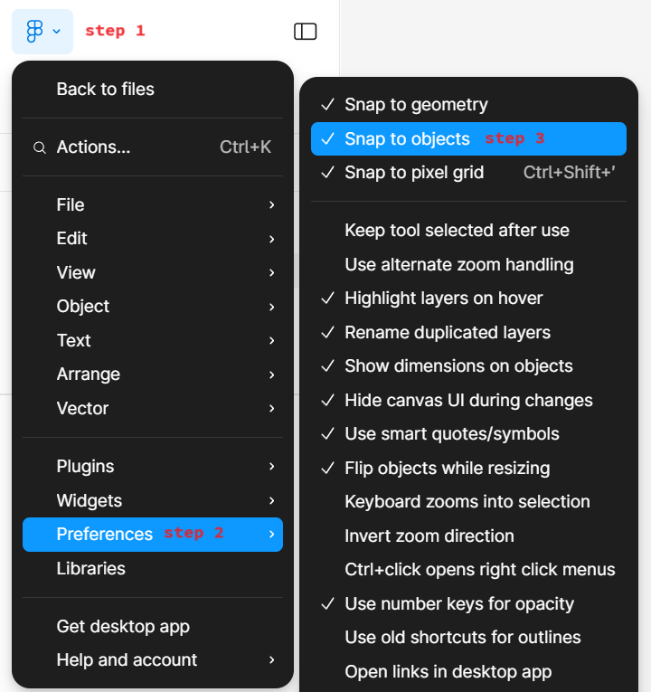

### Constraints

约束(Constraints)：当父 Frame 调整大小时，子图层使用约束(Constraints)确定它们如何响应。

这在跨不同设备设计时尤其有用，以确保设计响应并适配不同的屏幕。

约束(Constraints)：

1. 使用约束(Constraints)来确保侧边栏始终和页面高度保持一致。
2. 按钮始终固定的屏幕的右下方。

> Note：
>
> 1. 只要父 Frame 没有使用自动布局(Auto layout)，就可以将约束(Constraints)应用到任何子层。
>
> 2. 直接位于画布(Canvas)上的 Top Frame 和图层(Layer)没有约束(Constraints)设置，因为它们没有父Frame 来确定约束(Constraints)。

### Apply constraints to the text layer

我们希望文本图层在其父 Frame 调整大小时一直保持居中。

因此，选中文本图层，将其约束设置修改为“水平居中”和“垂直居中”。

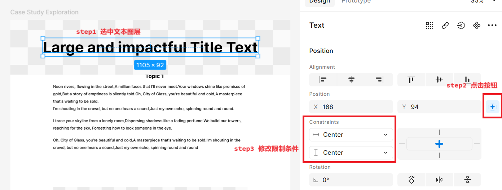

现在，当我调整 Frame 大小时，图层文本依然保持居中。

### Tidy up the layers

选择 Frame 中的所有子图层，水平居中，并为所有子图层分配垂直间距。

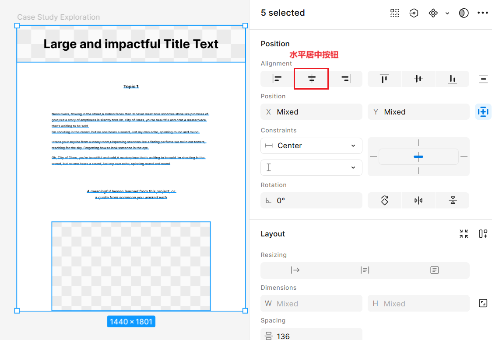

分配垂直间距：这会将我们的元素均匀分布在垂直轴上，从而允许快速重新排列我们的元素。

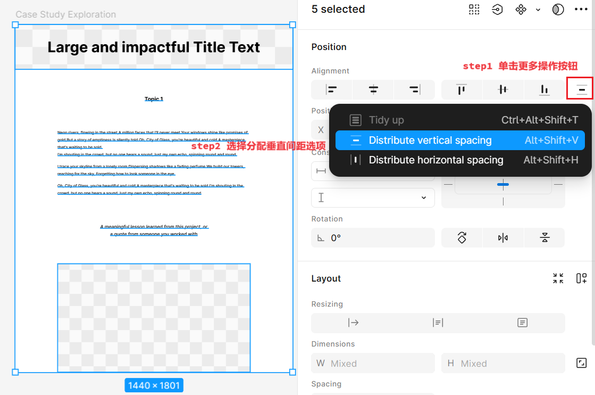

### Smart selection

当选择的对象在水平垂直轴上分布时，就可以进行智能选择(Smart selection)。

1. 智能选择(Smart selection)可以快速重新排列和调整选中的多个 图层之间的间距。
2. 将鼠标指针悬停在选定的元素上，并看到粉红色的圆圈和粉红色手柄时，则表示智能选择可用。
3. 单击并拖动粉色圆圈来重新排列图层的位置，同时保持整体的布局。
4. 选择一个粉色的圆圈，然后使用 `CTRL + D` ，快速复制图层到智能选择(Smart selection)。
5. 鼠标指针悬停在粉色手柄上即可查看图层之间的间距，然后单击并拖动粉色手柄来增加或减少间距。

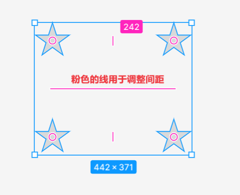

**鼠标指针悬停在选定的元素上，如果没有出现粉红色的手柄呢，可以尝试使用整理功能(Tidy up)？**

选中目标图层，使用右侧边栏位置(Position)部分的整理功能(Tidy up)，确保这些选中的图层在水平轴和垂直轴上均匀分布。

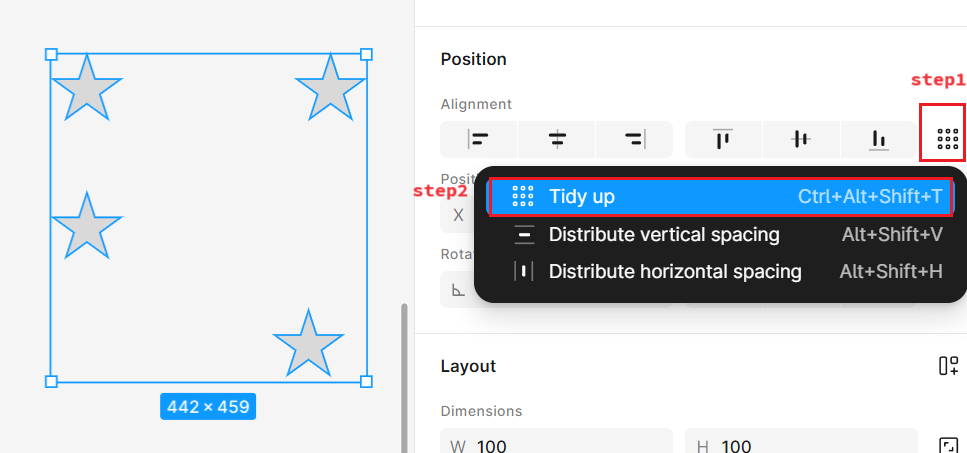

## Create the button

我们将使用自动布局(Auto layout)来构建一个响应式按钮元素，该元素会随着按钮内容的变化自动增大和缩小。

然后，将按钮转为主要组件(Main component)，方便可以在其他设计中复用。

### Auto layout

使用自动布局(Auto layout)，当设计更改时会自动调整布局，并保持设计的响应能力和适应性。

可以将自动布局(Auto layout)应用于框架(Frame)，将其转换为 Flex container，以便于组织设计元素、调整内部对象的间距，并快速将新内容插入到现有的设计中。

使用自动布局属性(Auto layout properties)来确定 Frame 子图层如何相互作用：

1. Resizing property：控制当子图层发生变化时，Frame 的高度和宽度如何响应。
2. Gap property：指定所有子图层之间的间距，包括水平间距和垂直间距。
3. Alignment property：决定了子图层在 Frame 内的对齐方式。
4. Padding property：指定了 Frame 边界和子图层之间的空间。

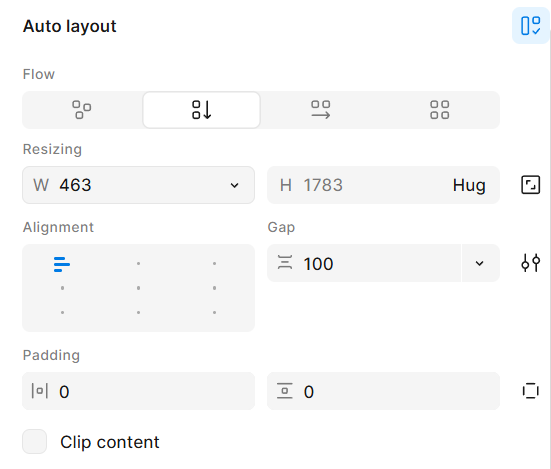

### Create a button using auto layout

在底部工具栏中选择文本工具，单击画布(Canvas)并输入内容。

设置文本图层样式：

- 字体大小：18 。
- 字体粗细：Semi Bold。
- 行高：Auto。
- 文本居中对齐。

选中文本图层，使用快捷键 `SHIFT + A`，Figma 自动在文本图层周围创建一个 Frame，并自动应用 Auto layout。

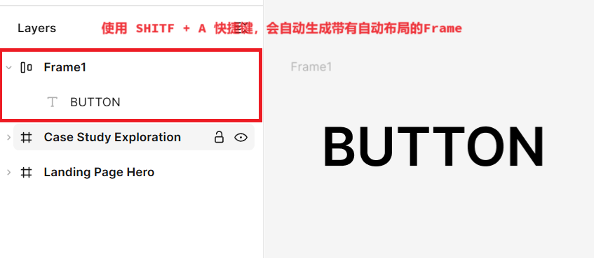

选中文本图层，设置颜色填充(Fill)为白色；选中 Frame 图层，设置颜色填充(Fill)为黑色。最后，为按钮添加圆角。

> tips: 在设置颜色填充时，只输入一个 F，Figma 就会填充为 FFFFFF，其他十六进制同理。

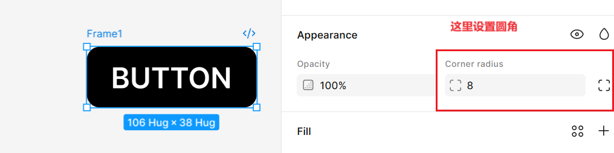

选中 Frame 图层，右侧边栏 Auto Layout 属性中，Resizing 设置为 Hug Content(环抱内容)，按钮的内容变化后，按钮的大小将自动响应。

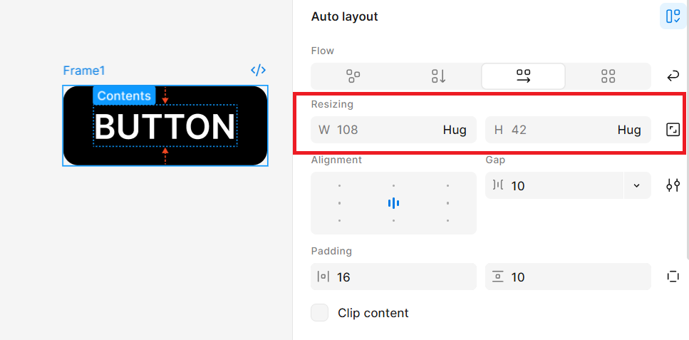

### Create component

将按钮变为一个主要组件(Main component)，达到组件复用的目的。

选中按钮 Frame 图层，单击右侧边栏的创建组件按钮，或使用快捷键 `CTRL + ALT + K`。

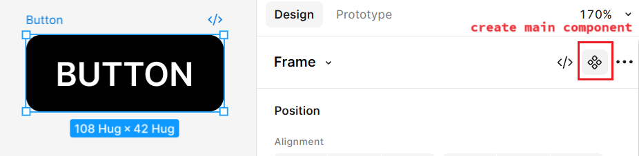

这时，按钮现在位于紫色边界框内，并且左侧边栏的图标也变为四个菱形图标，这表明该层是一个主要组件(Main component)。

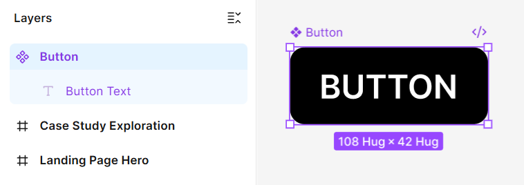

## Component fundamentals

### What is a component

组件是可重复使用的设计元素。不必重复设计相同的元素，并可以轻松管理整个设计的更改。

可以从任意图层集合创建主要组件(Main component)。这可以是一个简单的元素，比如图标、按钮；也可以是整个布局，比如卡片或者菜单。

组件有两个方面的定义：

1. 主要组件(Main component)
2. 组件实例(Instance copy of the main component)

### How to create component

创建主要组件(Main component)，首先选中要使用的图层，单击右侧边栏顶部 "create component" 按钮 或者使用 [快捷键](#Create component) 。

> tips: Figma 使用紫色边界框和四个菱形图标来表示主要组件(Main component)。

同时，还可以通过选择两个或者多个图层/对象，单击右侧边栏顶部 "create multiple components" 按钮来一次性创建多个组件。

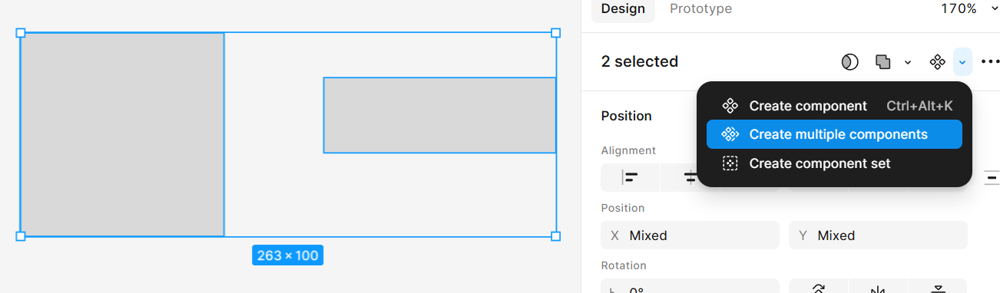

### Create instance

# Keyboard shortcuts

## Measure distance

测量图层(Layer)与框架(Frame)边缘的距离。

- windows：`ALT`。
- macos：`OPT`。

## Select all child layers in the frame

选择顶层框架(Top Frame)然后按 `Enter`。

## Auto layout

选中图层，按 `SHITF + A`，Figma 自动在图层周围创建一个 Frame，并自动应用 Auto layout。

## Create component

选中图层，创建组件，达到组件复用的目的。

- windows：`CTRL + ALT + K`。
- macos：`OPT + CMD + K`。